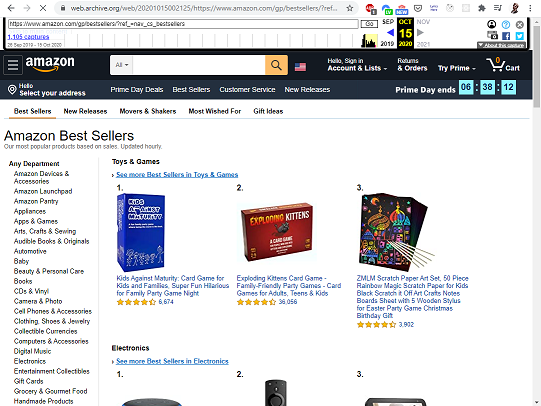
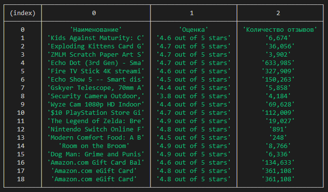
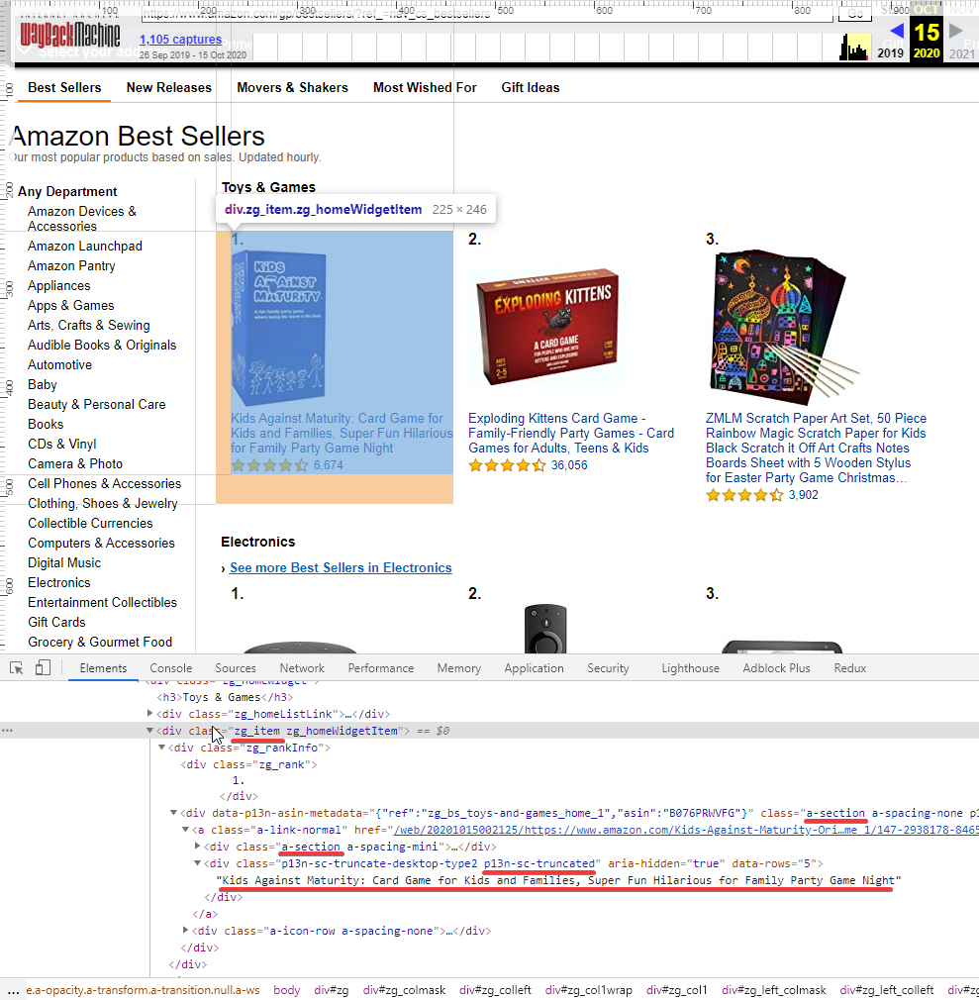

# Parsing 101

## Введение
В этом задании вам предстоит познакомиться с такой концепцией как "**парсинг**"
сайтов, или по-умному "**web scraping**".

Скрейпинг данных является довольно частой задачей в backend-программировании 
и будет полезно в ней разобраться.

## Releases

### Release 0: Знакомство

Прочитайте статьи про веб-скрейпинг, чтобы иметь представление о том, 
чем мы будем заниматься:
* [Wikipedia](https://ru.wikipedia.org/wiki/%D0%92%D0%B5%D0%B1-%D1%81%D0%BA%D1%80%D0%B5%D0%B9%D0%BF%D0%B8%D0%BD%D0%B3)
* [Quora](https://www.quora.com/What-is-the-difference-between-crawling-parsing-and-scraping)

Если вкратце, то задача веб-скрейпинга - найти на чужом сайте нужную 
информацию. Обычно она возникает в том случае, если целевой сайт не 
предоставляет свой собственный API.

### Release 1: Подготовка и постановка задачи

Мы будем скрейпить сайт amazon.com. А точнее - список самых популярных товаров.
Так как внешние сайты постоянно меняются, мы будем использовать 
зафиксированный во времени [снэпшот](https://ru.wikipedia.org/wiki/Snapshot) сайта из [Waybackmachine](https://en.wikipedia.org/wiki/Wayback_Machine).

Откройте ссылку https://web.archive.org/web/20201015002125/https://www.amazon.com/gp/bestsellers/?ref_=nav_cs_bestsellers. 

Вы должны увидеть что-то подобное:

На сайте представлен список самых продаваемых товаров. Наша задача - вытащить 
по указанной ссылке информацию в следующем виде:

### Release 2: Поиск структуры в данных

Откройте консоль разработчика в браузере и попробуйте понять, как выглядит 
каждый товар с точки зрения HTML. Наверняка, есть какие-то общие для всех 
товаров CSS-классы или общие HTML-элементы. Понимание структуры является 
ключевым шагом в написании скрейпера.

### Release 3: Загрузка HTML

Напишите код, который будет загружать HTML по указанной ссылке. Для этого вы 
можете использовать библиотеку [axios](https://github.com/axios/axios)
или любую другую. На выходе должен получиться HTML-текст.

### Release 4: Regular Expressions

Теперь придумайте одно или несколько [регулярных выражений](https://developer.mozilla.org/en-US/docs/Web/JavaScript/Reference/Global_Objects/String/matchAll)
для поиска среди массы тегов нужной информации о товаре.

Добейтесь того, чтобы на выходе получилась таблица в том виде, в котором она 
озвучена в `Release 1`.

P.S. Есть вероятность, что в инспекторе элементов некоторые теги были созданы 
динамически после загрузки страницы. То есть они отсутствуют в HTML, 
полученном нами с помощью `axios`. Поэтому будьте бдительны и проверьте 
ваши регулярные выражения на реальных данных.

P.P.S. Чтобы найти все символы включая переводы строк используйте `[\s\S]`.

### Release 5: DOM

Регулярные выражения - не единственный способ найти информацию в
HTML-документе. Вспомните, как в браузере вы ищете элементы с помощью 
`querySelector`. Почти то же самое можно делать и на сервере с помощью 
сторонних библиотек. В нашем случае мы будем пользоваться [cheerio](https://github.com/cheeriojs/cheerio).

Решите ту же самую задачу с помощью `cheerio`. Документация по cheerio: https://cheerio.js.org/.

### Finish

Поздравляю, вы освоили веб-скрейпинг!
